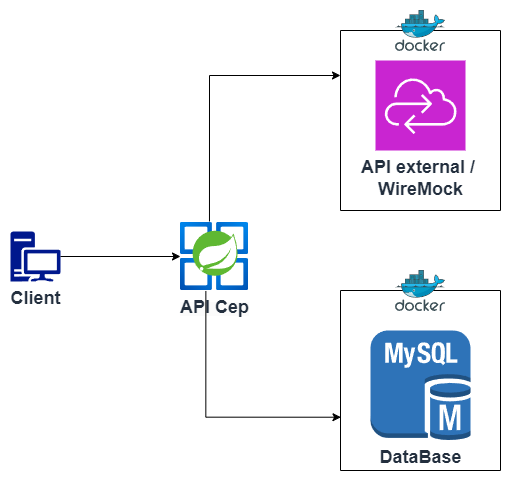

# Projeto de busca CEP Integrando com WireMock, MySQL e API Java

Este projeto tem como objetivo simular um serviço de consulta de CEPs utilizando o WireMock, dentro de um container Docker. O banco de dados MySQL também está em um container Docker e é utilizado pela API Java para registrar as consultas realizadas, juntamente com o horário da pesquisa.

## Desenho de solução

## Estrutura do Projeto

- **WireMock**: Serviço mockado para simulação de consultas de CEP.
- **MySQL**: Banco de dados que registra as consultas realizadas.
- **API Java**: API que interage com o serviço WireMock, executa as pesquisas e registra os dados no banco de dados.

## Requisitos

- Docker e Docker Compose instalados no seu sistema.
- Java 11.
- Maven para gerenciar dependências Java (se aplicável).

## Como Rodar o Projeto

### Passo 1: Subindo os containers Docker

Para iniciar os containers com o WireMock e o MySQL, execute o seguinte comando no diretório onde está o arquivo docker-compose.yml:

> docker-compose up -d

Esse comando vai subir dois containers:

WireMock: Um servidor mockado para simulação de consultas de CEP.
MySQL: Banco de dados MySQL para registrar as consultas feitas pela API.

### Passo 2: Verificar se os containers estão rodando

Após executar o comando acima, você pode verificar se os containers estão funcionando corretamente com:

> docker ps

Os containers wiremock e mysql devem aparecer na lista.

### Passo 3: Acessar o MySQL no Container

Para acessar o MySQL no container, execute o seguinte comando:

> docker exec -it <container_id> mysql -u root -p

Substitua <container_id> pelo ID do container do MySQL, que você pode obter com **docker ps**.